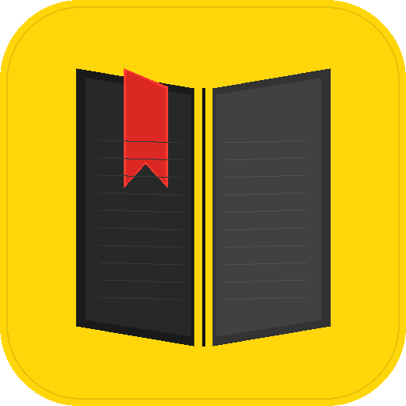

# 📖 Blist — Your Book List Tracker

<p align="center">
  
</p>

<p align="center">
  <strong>A beautiful, mobile-first book tracker built on Google Apps Script</strong><br>
  <em>Free forever • No server needed • Your data stays in YOUR Google Drive</em>
</p>

---

## What is Blist?

Blist is a personal book list tracker that runs entirely on Google Apps Script. It stores your books in a Google Sheet in your own Drive — no servers, no databases, no subscriptions. Deploy in 5 minutes, use forever.

### Features

- **Search & add books** via Open Library (free, no API key needed)
- **Add books manually** when search doesn't find them
- **Tinder-style swipeable cards** with full-bleed cover images
- **List view** for quick scanning
- **Dashboard** with reading stats, progress bar, and location breakdown
- **Rich metadata** — format, location, ownership, status, rating, recommendation, notes
- **Duplicate detection** — ISBN match + fuzzy title matching prevents double entries
- **Search your books** by title or author (server-side, fast)
- **Share book cards** as images (JPEG, optimized for sharing)
- **iOS home screen widget** via Scriptable (shows stats + random book cover, rotates hourly)
- **Mobile-first** — designed for phones, works everywhere
- **Multi-user** — each person gets their own sheet automatically

### Data Model

Your books live in a `Blist_Books` tab with these columns:

| Column | Values |
|--------|--------|
| ID | Auto-generated UUID |
| Title | Book title |
| Author | Author name(s) |
| ISBN | ISBN-10 or ISBN-13 |
| CoverURL | Cover image URL (from Open Library) |
| Description | Short description |
| Format | Physical / Digital / Both |
| Location | Google Books, Kindle, Drive Files, Physical, or custom |
| Ownership | Own / Buy |
| Status | To Read / Reading / Read / Don't Read |
| Rating | 1–5 stars |
| Recommend | Yes / No |
| Notes | Free text |
| DateAdded | Timestamp |
| DateModified | Timestamp |

---

## 🚀 Setup (5 minutes)

### Step 1: Create the Apps Script Project

1. Go to [script.google.com](https://script.google.com)
2. Click **New Project**
3. Rename it to **Blist**

### Step 2: Add the Code Files

**Code.gs:**
1. Click the default `Code.gs` file
2. Delete all existing content
3. Paste the entire contents of [`Code.gs`](Code.gs) from this repo

**Index.html:**
1. Click **+** next to "Files" → select **HTML**
2. Name it **Index** (it becomes `Index.html`)
3. Paste the entire contents of [`Index.html`](Index.html) from this repo

### Step 3: Deploy

1. Click **Deploy** → **New deployment**
2. Click the gear icon → **Web app**
3. **Execute as:** User accessing the web app
4. **Who has access:** Anyone with Google account
5. Click **Deploy**
6. **Authorize** when prompted (review permissions → Allow)
7. Copy the **Web app URL** — that's your Blist!

### Step 4: Open & Use

- Open the URL in your phone browser
- **Android:** Chrome → ⋮ menu → "Add to Home screen"
- **iOS:** Safari → Share button → "Add to Home Screen"

---

## 📂 What Gets Created in Your Drive

On first visit, Blist automatically creates:

```
📁 Library/
  📊 Blist – My Book List     (your private book data)
  🖼️ blist-icon-192.png        (homescreen icon)
```

---

## 📱 iOS Widget (Optional)

Show your book stats and a random book cover on your iPhone home screen using [Scriptable](https://apps.apple.com/app/scriptable/id1405459188) (free app).

The cover image changes every hour automatically.

### Widget Setup

**1. Set up the data feed:**
- In Apps Script editor, select `setupWidgetTrigger` from the function dropdown
- Click **Run** and authorize
- This creates a separate public spreadsheet ("Blist Widget Data") in your Library folder
- Check the **Execution Log** (View → Execution log) — it prints the **Sheet ID** you need

**2. Install the widget:**
- Install [Scriptable](https://apps.apple.com/app/scriptable/id1405459188) on your iPhone
- Open Scriptable → tap **+** → paste the contents of [`Blist-Widget.js`](Blist-Widget.js)
- **Line 16:** Replace `PASTE_YOUR_SHEET_ID_HERE` with your Sheet ID (use straight quotes)
- **Line 19:** Replace `PASTE_YOUR_APPS_SCRIPT_URL_HERE` with your Blist URL
- Tap ▶ to test — you should see a preview

**3. Add to home screen:**
- Long press home screen → **+** → search **Scriptable**
- Choose **Small** or **Medium** widget
- Long press the widget → **Edit Widget** → select your Blist script

### Widget Sizes

| Small | Medium |
|-------|--------|
| Full-bleed book cover | Book cover on the left |
| Title + author overlay | Full stats grid on the right |
| Total / Reading / Buy pills | All 8 stat categories |

### Privacy

Your main book data stays private. The widget uses a **separate, read-only spreadsheet** that contains only summary stats and one book title/cover at a time. Your full book list is never exposed.

---

## 🔄 Updating

After making code changes:
1. **Deploy** → **Manage deployments** → click ✏️ edit
2. Change Version to **New version**
3. Click **Deploy**

Your URL stays the same — bookmarks and home screen shortcuts keep working.

---

## 🛠️ Tech Stack

| Layer | Technology |
|-------|-----------|
| Backend | Google Apps Script |
| Frontend | Vanilla HTML / CSS / JS (no frameworks) |
| Data | Google Sheets (one per user) |
| Book Search | Open Library API (free, no key) |
| Image Capture | html2canvas (for share feature) |
| Font | [Outfit](https://fonts.google.com/specimen/Outfit) |
| iOS Widget | [Scriptable](https://scriptable.app) |

---

## 📝 License

MIT License — free to use, modify, and distribute.

**Attribution required:** Please keep the "Built with ♥ by The Round Pencil & Claude" credit visible.

---

## 🙏 Credits

Built with ♥ by **[The Round Pencil](https://theroundpencil.com)** & **[Claude](https://claude.ai)** by Anthropic

---

*Blist — because every book deserves to be listed.*
